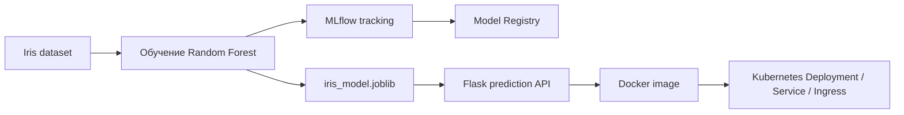

# Iris ML API: MLflow, Docker и Kubernetes

Компактный end-to-end MLOps-проект, в котором обучается классификатор для Iris, ведётся трекинг экспериментов, регистрируется лучшая модель, поднимается Flask API и добавляются Docker- и Kubernetes-манифесты для деплоя.

## Результаты

| Количество деревьев | Максимальная глубина | Accuracy на hold-out |
|---:|---:|---:|
| 100 | 5 | **1.0000** |
| 200 | 100 | **1.0000** |
| 500 | None | **1.0000** |

## Архитектура



## Что показывает проект

- обучение и сравнение нескольких конфигураций Random Forest;
- логирование параметров, accuracy и артефактов модели в MLflow;
- регистрация модели и перевод лучшей версии в `Production`;
- сохранение локальной модели через joblib;
- запуск health и prediction endpoint через Flask;
- упаковка сервиса в Docker;
- деплой через Kubernetes Deployment, Service и Ingress.

## Инструменты

Python, scikit-learn, MLflow, Flask, joblib, Docker, Kubernetes.

## Пример запроса к API

```bash
curl -X POST http://localhost:5050/predict \
  -H "Content-Type: application/json" \
  -d '{"sepal_length":5.1,"sepal_width":3.5,"petal_length":1.4,"petal_width":0.2}'
```


## Локальный запуск

Сначала поднимите MLflow-сервер на `http://localhost:5000`, затем выполните:

```bash
pip install -r requirements.txt
python main.py
python app.py
```
